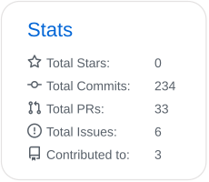

<!--
**CShoku/CShoku** is a ✨ _special_ ✨ repository because its `README.md` (this file) appears on your GitHub profile.

Here are some ideas to get you started:

- 🔭 I’m currently working on ...
- 🌱 I’m currently learning ...
- 👯 I’m looking to collaborate on ...
- 🤔 I’m looking for help with ...
- 💬 Ask me about ...
- 📫 How to reach me: ...
- 😄 Pronouns: ...
- ⚡ Fun fact: ...
-->

## 💬 About Me

- Fourth-year undergraduate student at Hokkaido University
  - Department of Electronics and Information Engineering, School of Engineering

- Software Engineer / Long-term internship at **LetterFan Inc.**

## 🌱 Skills

  

- Currently learning more about **Next.js**, **Google Cloud Platform (GCP)** and **Terraform**.

## 📊 Activities

  

